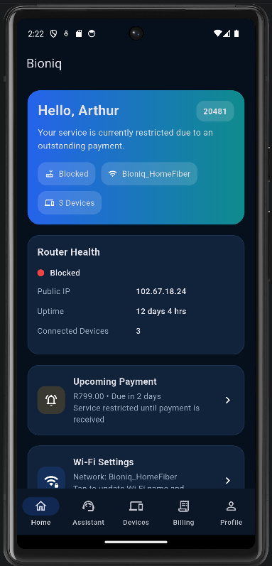
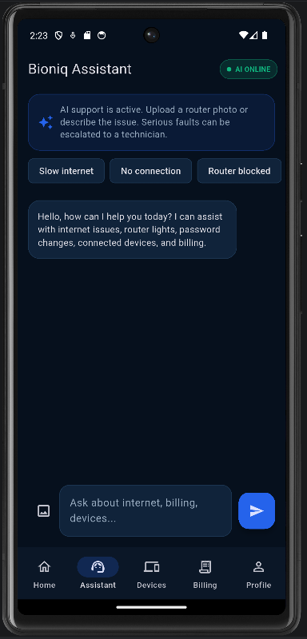
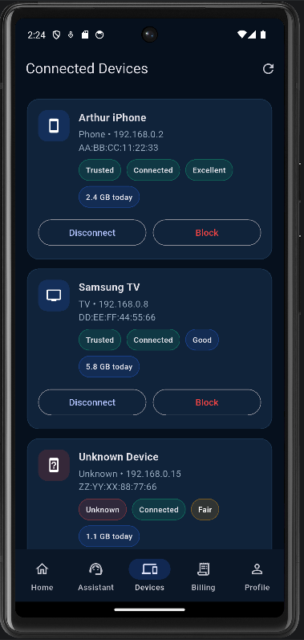
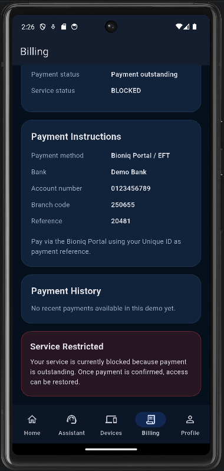
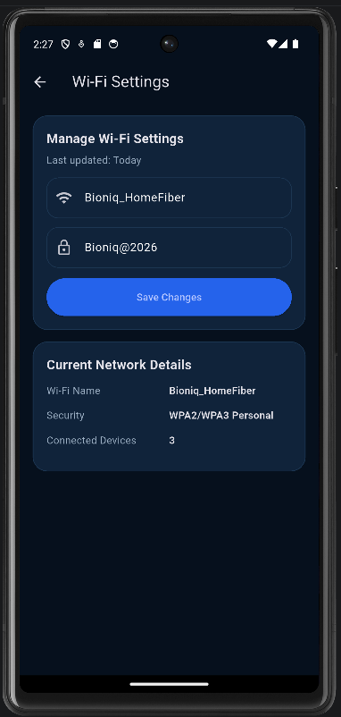

# Bioniq App

A mobile application designed for ISP customers to manage their network, control connected devices, handle billing, and receive AI-powered support.

---

## Purpose

This project demonstrates how an Internet Service Provider (ISP) can improve customer experience by combining a mobile application with AI-powered support.

It focuses on reducing manual support workload, giving users direct control over their network, and enabling faster issue resolution through automation.

---

## Overview

Bioniq improves customer experience by giving users control over their network and access to automated support.

The system integrates AI to assist with troubleshooting, device management, and billing-related queries, reducing the need for direct technician intervention.

---

## Features

- Secure login using client ID  
- Wi-Fi settings management (SSID & password)  
- View and control connected devices  
- Block or disconnect unknown users  
- Billing system with payment status  
- Service restriction when payment is overdue  
- AI assistant for customer support  

---

## Tech Stack

- Frontend: Flutter  
- Backend: Node.js (Express)  
- AI Integration: Google Gemini API   

---

## Key Concept

This project is built around the idea of a "self-service ISP system", where customers can resolve most issues without contacting support.

The AI assistant acts as the first line of support, while the mobile app provides full control over network settings, devices, and billing.

---

## Screenshots

